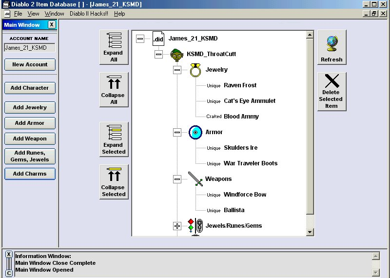



## Diablo 2 Item Database V3\.0\.2 \(UPDATE\)

### Description

This will help you keep track of all your "mules" items. It also show you how to load/save data from the tree view control with pictures(obviousley). This is a complete application. The registery functions are not mine and I forgot whos they are *sorry*, but I did put the names of the people who made the hacks(will and max). Check it out has some nice features. I made it for my friends. Tell me what you think, leave some fedback and vote please, Spent a lot of time on this.

www.Bright.net/~james-d-21/

(there are no advertisments, Just download link)
 
### More Info
 

             |
---                |---
**Submitted On**   |2002-03-19 17:51:58
**By**             |[James Dougherty](https://github.com/Planet-Source-Code/PSCIndex/blob/master/ByAuthor/james-dougherty.md)
**Level**          |Intermediate
**User Rating**    |4.0 (20 globes from 5 users)
**Compatibility**  |VB 6\.0
**Category**       |[Complete Applications](https://github.com/Planet-Source-Code/PSCIndex/blob/master/ByCategory/complete-applications__1-27.md)
**World**          |[Visual Basic](https://github.com/Planet-Source-Code/PSCIndex/blob/master/ByWorld/visual-basic.md)
**Archive File**   |[Diablo\_2\_I1392471012002\.zip](https://github.com/Planet-Source-Code/james-dougherty-diablo-2-item-database-v3-0-2-update__1-32845/archive/master.zip)

### API Declarations

In case you try before you look at the code the pass. is KSMD or ksmd. Enjoy -James-

